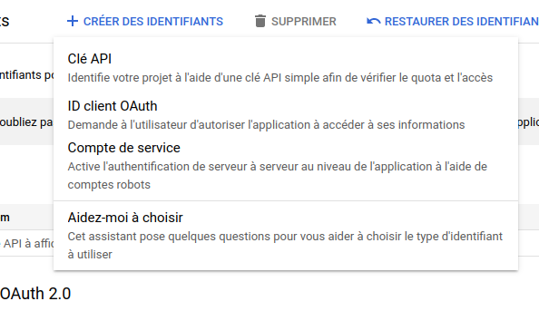
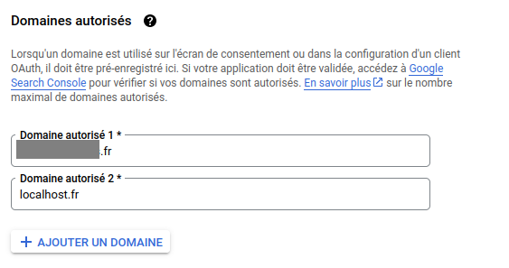

# Guide d'authentification et d'accès à l'API Google

## Sommaire
### [Introduction](#introduction)
### [Étapes à suivre](#step)
### [1. Création d'un projet sur la console Google Cloud](#step-1)
### [2. Activation de l'API YouTube](#step-2)
### [3. Obtention de la clé publique](#step-3)
### [4. Configuration des identifiants OAuth](#step-4)

## Introduction
Ce guide explique comment obtenir une clé publique et des identifiants OAuth pour accéder à l'API Google, en mettant l'accent sur l'API YouTube. Ces étapes sont nécessaires pour accéder aux fonctionnalités de l'API Google, y compris YouTube, et effectuer des opérations telles que la récupération de données ou la gestion de contenu.

## Étapes à suivre

### 1. Création d'un projet sur la console Google Cloud

1. Accédez à la [Console Google Cloud](https://console.cloud.google.com/).
2. Créez un nouveau projet ou sélectionnez un projet existant.

3. Si c'est un nouveau projet, donnez un nom à ce dernier puis Cliquez sur Créer

Attendez que le projet soit créer, cela peut prendre quelques minutes.

### 2. Activation de l'API YouTube

1. Sélectionnez le projet que vous avez créé.

2. Dans la console Google Cloud, accédez à la section "API et services", puis Bibliothèque.
3. Recherchez "YouTube Data API" et activez-le pour votre projet.

### 3. Obtention de la clé publique

1. Dans la console Google Cloud, accédez à la section "Clés API".

2. Cliquez sur "Créer une clé API" et sélectionnez "Clé d'API".

3. Une fois créée, notez votre clé publique.

#### Utilisation sécurisée de la clé publique

> <b>Attention:</b> N'oubliez pas de restreindre l'utilisation de votre clé publique fraîchement créée afin de minimiser les risques d'abus ou de mauvaise utilisation. Vous pouvez limiter les domaines autorisés, les types d'opérations, ou d'autres paramètres en fonction de vos besoins spécifiques. Consultez la documentation officielle de Google pour obtenir des instructions détaillées sur la configuration des restrictions de clé.  
> En suivant ces bonnes pratiques de sécurité, vous contribuez à protéger votre application et les données de vos utilisateurs contre les menaces potentielles.

### 4. Configuration des identifiants OAuth

1. Toujours dans la console Google Cloud, accédez à la section "Identifiants".
2. Cliquez sur "ID client OAuth" puis sur "Configurer l'écran de consentement".

3. Sélectionnez "Externes" puis "créer".
4. Complétez les informations sur l'application.

5. Indiquez les noms des domaines valide. J'indique le ou les noms de domaine concernés. Vous pourrez les modifier tout au long de la durée de vie de votre application.

6. Cliquez à nouveau sur "ID client OAuth".
7. Choisissez le type d'application approprié (par exemple, "Application Web" pour une application web).

8. Configurez les paramètres requis, tels que les URI de redirection autorisés. (Vous pourrez les modifier tout au long de la durée de vie de votre application.) Puis validez.

9. Une fois créés, notez votre ID client OAuth et votre secret client.

## Utilisation dans votre application

Une fois que vous avez obtenu votre clé publique et vos identifiants OAuth, vous pouvez les utiliser dans votre application pour accéder à l'API Google, y compris l'API YouTube.
Assurez-vous de suivre les bonnes pratiques en matière de sécurité et de gestion des clés d'API.
Stocker ces diverses informations dans votre fichier .env .
N'oubliez pas de consulter la documentation officielle de Google pour plus de détails et pour vous assurer de respecter les conditions d'utilisation des API Google.
